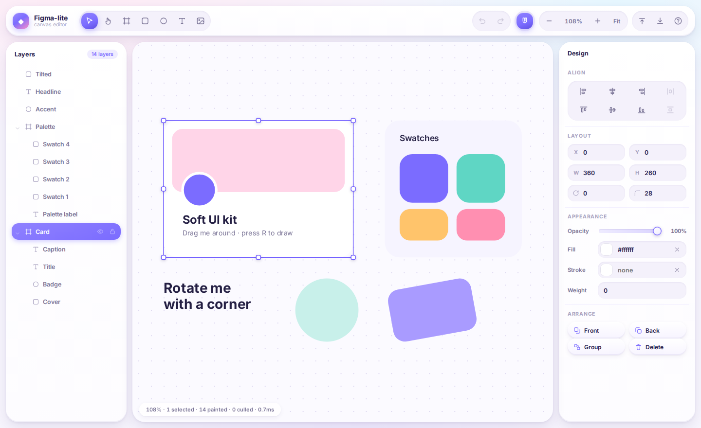

# Figma-lite

A miniature vector design editor that runs in the browser. Canvas, layers,
select / move / resize / rotate, snapping, grouping, undo-redo, JSON import and
export — built as an exercise in editor architecture, with no runtime
dependencies.



```bash
npm install
npm run dev        # http://localhost:5173
npm test           # 183 unit tests, straight against the TS sources
npm run check      # typecheck + unit tests + production build
npm run test:e2e   # 25 checks driving a real browser (needs `npx playwright install chromium`)
```

---

## Architecture

The interesting part of a design tool is not any single feature; it is the set
of boundaries that let features be added without the whole thing collapsing.
Five layers, each depending only on the ones above it:

```
Document Model     immutable scene graph            core/types.ts, core/document.ts
      ↓
Command System     pure (Document) => Document      core/commands.ts
      ↓
History Manager    undo patches by reference-diff   core/history.ts
      ↓
Renderer           Canvas2D painter + overlay       render/renderer.ts, render/overlay.ts
      ↓
Interaction        gesture state machine            interaction/tools.ts
```

`core/editor.ts` is the seam between them: it owns the document, selection,
viewport and active tool, and is the only place that writes to any of them.

### Document model

Nodes live in one flat `Record<NodeId, SceneNode>`; the tree is expressed by
`children: NodeId[]` on containers plus a `parent` back-pointer.

Flat storage makes lookup O(1), but the real reason for it is **structural
sharing**: an edit clones only the nodes it touches, so two documents can be
compared by reference to find exactly what changed. Everything below depends on
that one property.

Every node is immutable. `x/y/w/h/rotation` are stored in *parent* space, with
rotation applied about the box centre — the same convention Figma uses, and the
reason `resizedBox` has to solve for a pinned anchor rather than just setting a
width.

### Command system

Every edit is a pure function `(Document, args) => Document`. Commands never
touch selection, history, or the DOM. That restraint is what makes undo,
scripting and the JSON round-trip fall out for free rather than being three
separate implementations.

```ts
const next = translateNodes(doc, ["a", "b"], 10, 0);
const { doc: grouped, groupId } = groupNodes(next, ["a", "b"]);
```

### History manager

The layer people usually over-engineer. Because commands clone only what they
touch, undo does **not** need each command to hand-write an inverse — diffing
the before and after documents by reference yields the exact changed set, and
storing both sides gives a patch applicable in either direction.

- One mechanism covers property edits, insertion, deletion, reparenting and
  grouping alike. A new command gets undo for free and cannot get it wrong.
- A patch is O(changed nodes), not O(document). Dragging one rectangle around a
  5,000-node file stores one node per entry.
- Rapid same-key edits (holding an arrow key, dragging the opacity slider)
  coalesce, so undo steps back in meaningful units.

Drags use a different path again: `editor.begin()` snapshots, `editor.live()`
applies intermediate states without recording, and `editor.end()` records the
net change. A 300-frame move gesture produces exactly one undo entry, and the
interaction code never has to think about history.

### Renderer

A retained model painted in immediate mode: there is no display list to keep in
sync, each frame walks the tree. What keeps that cheap:

- repaint only on a dirty flag, at most once per animation frame;
- cull subtrees whose world bounds miss the viewport;
- skip invisible or fully transparent subtrees entirely;
- cache text layout and decoded images;
- **keep selection chrome on a second canvas**, so dragging a handle never
  repaints the scene — the cost of interaction is independent of document size.

The world transform is threaded through the recursion rather than recomputed per
node; recomputing it would make painting O(depth²). The status bar reports
painted / culled / frame time live.

### Interaction engine

An explicit state machine. Exactly one gesture is active at a time, and each
gesture owns the document snapshot it started from:

```
idle ──pointerdown──▶ press ──past threshold──▶ move / marquee / create
  ▲                     │                               │
  └──────pointerup──────┴───────────────────────────────┘
```

Resize and rotate are entered directly from a handle hit, skipping `press`.

Every frame recomputes the result **from the gesture's starting snapshot**
rather than accumulating deltas onto the live document. So a drag cannot drift,
and pressing or releasing Shift mid-gesture re-derives the correct answer
instead of trying to unwind a previous increment.

---

## The parts that are actually hard

**Coordinate systems.** Three spaces, and confusing them is the top source of
bugs in a canvas app:

| space | meaning |
|---|---|
| screen | CSS pixels in the canvas element |
| world | the page's own units — what top-level nodes store |
| local | a node's own space, where its box is always `(0, 0, w, h)` |

Conversions live in exactly two places: `core/viewport.ts` for screen↔world and
`worldTransform()` for local→world.

**Hit testing** maps the *pointer* into each node's local space through the
inverse world transform, rather than mapping nodes into screen space. A rotated,
nested ellipse is then just `x²/a² + y²/b² ≤ 1`. Rotation and nesting need no
special cases at all.

**Rotated resize.** Dragging a handle must keep the opposite corner pinned. The
drag vector is un-rotated into the node's own axes to get the new size, then
`resizedBox` solves for the top-left that puts the anchor back where it was:

```
topLeft = pinned − R(θ)·((anchor − ½)·size) − size/2
```

**Marquee selection** uses a separating-axis test against each node's rotated
rectangle, so a 45°-rotated square is not selected merely because its
axis-aligned bounding box overlaps the band.

**Snapping** tolerance is defined in *screen* pixels and divided by zoom, so it
feels equally sticky at 10% and at 800%.

**Import is untrusted input.** `deserialize` rebuilds the document field by
field rather than casting the parsed JSON: unknown node types are dropped,
dangling child references are pruned, nodes claimed by two parents keep the
first, parent cycles are broken, and non-`data:` image URLs are stripped so
opening a shared file cannot fire a request at a third party.

---

## Features

**Canvas** — select, move, resize, rotate, multi-select, marquee, snapping with
alignment guides, grid snap, zoom, pan, infinite canvas.

**Structure** — layers tree with drag-to-reorder and drag-to-reparent, grouping
and ungrouping, frames that clip, double-click to drill into a group, per-layer
visibility and lock, rename in place.

**Editing** — alignment and distribution, z-order, in-place text editing,
image drop and paste, an inspector with live numeric fields.

**Document** — undo/redo, copy/cut/paste/duplicate (via a JSON payload, so it
crosses tabs), a library of saved designs, autosave.

**Export** — PNG and JPG at 1–4×, whole page or selection only; JSON to reopen
here; and PDF.

### PDF is real vectors

The PDF writer is hand-rolled (`src/export/pdf.ts`, no dependency). Shapes
become PDF path operators and text becomes text, so output scales without
pixelating, prints properly, and stays selectable and searchable — the sample
scene is ~20 KB. A PDF that is merely a wrapped bitmap would be a worse PNG.

Two coordinate quirks drive most of that file: PDF's origin is bottom-left with
Y up, so the page opens with a flip and node transforms emit unchanged; and
glyphs under that flip would be upside down, so each text run re-flips via its
text matrix. Known limits: fonts are the standard 14, so custom families are
substituted, and embedded images are re-encoded to JPEG, so transparency
composites onto white.

### How persistence works

| | |
|---|---|
| **Autosave** | The whole document is serialised to `localStorage` under `figma-lite:document`, 800 ms after the last change. On boot it is read back through the same defensive importer the file format uses. |
| **What survives a refresh** | Every node, and only that. |
| **What does not** | Undo history, selection, zoom and pan, active tool. Restoring an undo stack that no longer matches what you remember doing is worse than starting clean. |
| **Capacity** | IndexedDB is disk-backed — typically a large fraction of free space, versus localStorage's hard ~5 MB origin cap. Since images are inlined as base64 `data:` URLs (+33%), two pasted screenshots would have exceeded the old cap on their own. |
| **Cost per save** | Only the nodes that changed are written. `diffDocuments` — the same reference comparison the undo system is built on — yields the changed set, so autosaving a 5,000-node document costs the same as a 5-node one. localStorage could not use that information: it can only replace the whole value, so every save re-serialised everything on the main thread. |
| **Visibility** | The document chip in the toolbar opens a storage panel: real usage from `navigator.storage.estimate()`, every saved design with its size, and delete / clear-all. Browser storage is invisible by default; this app does not get to quietly hold your disk. |

Clearing site data returns you to the starter scene. Both behaviours are covered
by the end-to-end suite.

Press `?` in the app for the full shortcut sheet — it is generated from the
shortcut table itself, so a shortcut cannot exist without being documented.

| | |
|---|---|
| `V` `H` `F` `R` `O` `T` | select, hand, frame, rectangle, ellipse, text |
| `⌘Z` / `⌘⇧Z` | undo / redo |
| `⌘G` / `⌘⇧G` | group / ungroup |
| `⌘D`, `⌘C`, `⌘V`, `⌘X` | duplicate, copy, paste, cut |
| `⌘1` / `⌘0` / `⌘2` | zoom to fit / 100% / selection |
| Space-drag, `⌘`-scroll | pan, zoom at pointer |
| Alt-drag / Shift-drag | duplicate while moving / constrain to an axis |
| Shift-resize / Alt-resize | keep aspect ratio / resize about the centre |

---

## Testing

183 tests, run with Node's built-in runner against the TypeScript sources
directly (no build step):

| file | covers |
|---|---|
| `math.test.ts` | matrix algebra, inversion, rotated bounds |
| `document.test.ts` | nested and rotated world transforms, tree queries |
| `commands.test.ts` | structural sharing, reparenting, grouping, resize maths |
| `history.test.ts` | diffing, undo/redo, gesture collapsing, coalescing |
| `serialize.test.ts` | round trips, and hostile input: cycles, dangling refs, garbage |
| `hittest.test.ts` | rotated shapes, clipping, scoping, SAT marquee |
| `snapping.test.ts` | edge/centre snapping, zoom-relative tolerance |
| `storage.test.ts` | incremental write plans, size accounting, the v1→v2 schema upgrade, backend fallbacks |

`test/e2e.mjs` drives the production build in headless Chromium: it asserts the
app boots with no console errors, that the canvas actually paints pixels, that
draw / undo / redo / move / zoom / persistence round trips work through real
input events, and that exports are valid files — down to walking the PDF's
cross-reference table and checking every offset lands on a real object. That layer earns its keep — it is what caught an invisible
modal backdrop swallowing every pointer event in the app, which no unit test
could have seen.

The invariants worth knowing about, because everything else rests on them:

- an edit leaves untouched nodes reference-identical (history depends on it);
- reparenting, grouping and ungrouping never move anything on screen;
- a gesture of 50 live steps produces exactly one undo entry;
- a malformed file can never produce a document that hangs a traversal.

---

## Layout

```
src/
  core/         types, document queries, commands, history, editor, viewport, serialize, storage
  export/       PNG/JPG raster export, hand-written vector PDF writer
  render/       scene renderer, overlay renderer, text layout, image cache
  interaction/  hit testing, snapping, gesture state machine, actions, shortcuts, clipboard
  ui/           toolbar, layers panel, properties panel, text editor, help, toasts
test/           unit tests
```
